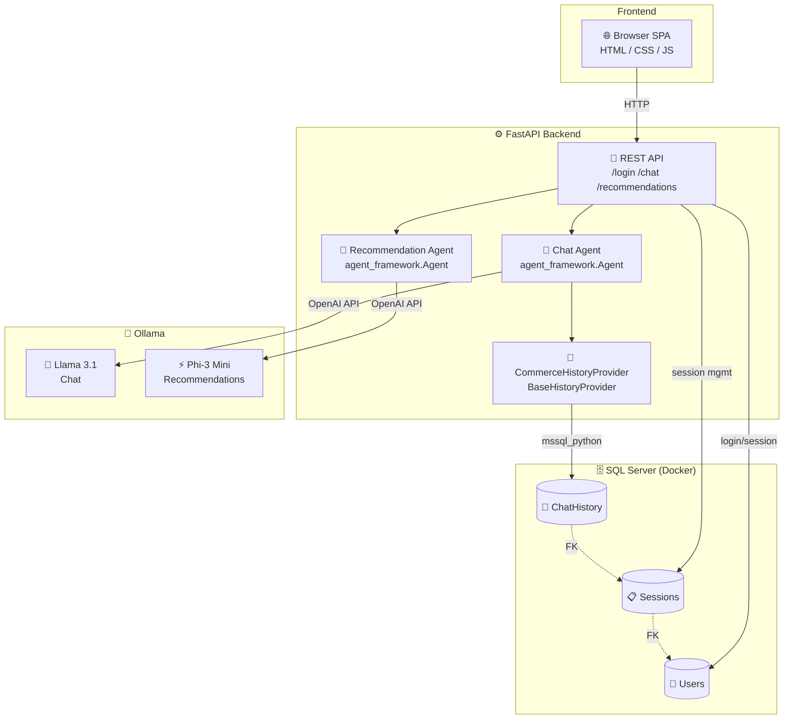

# 🛍️ Commerce Agent

A personalized shopping assistant web app powered by [Microsoft Agent Framework](https://learn.microsoft.com/en-us/agent-framework/) and local LLMs via [Ollama](https://ollama.com).

<p align="center">
  
</p>

Log in as **Marla** or **Steve**, chat with your AI shopping assistant about your preferences, and get personalized product recommendations — all backed by persistent SQL Server conversation history.

## 🎬 Demo

https://github.com/softchris/ecommerce-agent-memory/raw/master/assets/demo.mp4

## ✨ Features

- 🔐 **User login** — switch between users, each with their own conversation history
- 💬 **AI chat** — conversational shopping assistant powered by Llama 3.1
- 🧠 **Memory** — conversations persist in SQL Server across sessions
- 🎯 **Smart recommendations** — LLM analyzes your preferences with deterministic fallback
- ⚡ **Model warmup** — pre-loads Ollama models on startup for fast responses
- 🏗️ **Microsoft Agent Framework** — built on `BaseHistoryProvider` for proper session management

## 🏗️ Architecture



## 📋 Prerequisites

| Requirement | Version | Purpose |
|---|---|---|
| 🐍 **Python** | 3.12+ | Runtime |
| 📦 **uv** | 0.8+ | Package manager |
| 🐳 **Docker** | Latest | SQL Server container |
| 🦙 **Ollama** | Latest | Local LLM inference |

## 🚀 Setup

In the setup steps below we cover:

- Pulling the SQL Server Docker image.
- Starting the SQL Server container.
- Pulling the necessary Ollama models.

### 0. Pull the SQL Server Docker image

Pulls down the SQL Server 2022 image from Microsoft's container registry, i.e ready to run locally.

```bash

```powershell
docker run -d `
  --name sql `
  -e "ACCEPT_EULA=Y" `
  -e "MSSQL_SA_PASSWORD=YourStrong!Passw0rd" `
  -p 1433:1433 `
  -v sqlvolume:/var/opt/mssql `
  mcr.microsoft.com/mssql/server:2022-latest
```

### 1. Start SQL Server

Starts a container so you can speak to the database.

```powershell
docker run -d `
  --name sql `
  -e "ACCEPT_EULA=Y" `
  -e "MSSQL_SA_PASSWORD=YourStrong!Passw0rd" `
  -p 1433:1433 `
  -v sqlvolume:/var/opt/mssql `
  mcr.microsoft.com/mssql/server:2022-latest
```

### 2. Pull Ollama models

```bash
ollama pull llama3.1
ollama pull phi3:mini
```

### 3. Install dependencies

```bash
cd commerce-agent
uv sync
uv pip install fastapi uvicorn httpx
```

## 🚀 Run the app

```bash
uv run uvicorn app:app --reload --port 8000
```

You'll see the models warming up:

```text
Database initialized ✅
Warming up llama3.1:latest...
  llama3.1:latest ready ✅
Warming up phi3:mini...
  phi3:mini ready ✅
Application startup complete.
```

### 5. Open the app

Navigate to **http://localhost:8000** 🎉

## 🗂️ Project Structure

```
commerce-agent/
├── app.py              # FastAPI backend — routes, agents, warmup
├── db.py               # Database init, user/session queries, history provider
├── products.py         # Product catalog, keyword scoring, recommendations
└── static/
    └── index.html      # Single-page app (login, chat, recommendations)
```

## 🎮 How It Works

1. **Log in** as Marla or Steve
2. **Chat** with the assistant — tell it what you like and don't like
3. **Click "Show me recommendations"** — the app analyzes your conversation and surfaces products that match your stated preferences
4. **Log out and back in** — your conversation history is preserved in SQL Server

## 🧩 Key Design Decisions

| Decision | Why |
|---|---|
| **Llama 3.1 for chat** | Best conversational quality among local models |
| **Phi-3 Mini for recommendations** | 2x faster, sufficient for structured JSON output |
| **LLM + deterministic fallback** | LLM picks products first; keyword scorer catches failures |
| **Model warmup on startup** | Prevents cold-start latency on first request |
| **`BaseHistoryProvider`** | Plugs into Agent Framework's session lifecycle properly |
| **Users + Sessions tables** | Supports multiple sessions per user |

## 🔧 How the History Provider Works

The `CommerceHistoryProvider` extends Agent Framework's `BaseHistoryProvider` to persist conversation history in SQL Server, scoped per session.

The framework calls `get_messages()` **before** each agent run to load context, and `save_messages()` **after** to persist new messages. Each session ID maps to a user, so different users get isolated conversation histories.

### Loading messages for a session

```python
async def get_messages(
    self, session_id: str | None, *, state: dict[str, Any] | None = None, **kwargs: Any
) -> list[Message]:
    conn = get_conn()
    cursor = conn.cursor()
    cursor.execute("""
        SELECT Role, Content FROM ChatHistory
        WHERE SessionId = ?
        ORDER BY CreatedAt
    """, (session_id,))
    rows = cursor.fetchall()
    conn.close()
    return [Message(role=role, text=content) for role, content in rows]
```

### Saving messages after a run

```python
async def save_messages(
    self,
    session_id: str | None,
    messages: Sequence[Message],
    *,
    state: dict[str, Any] | None = None,
    **kwargs: Any,
) -> None:
    conn = get_conn()
    cursor = conn.cursor()
    for msg in messages:
        text = msg.text or ""
        if not text and msg.contents:
            text = "".join(c.text for c in msg.contents if hasattr(c, "text"))
        cursor.execute(
            "INSERT INTO ChatHistory (SessionId, Role, Content) VALUES (?, ?, ?)",
            (session_id, msg.role, text)
        )
    conn.commit()
    conn.close()
```

### Wiring it up

The provider is passed to the agent via `context_providers`. The framework handles the lifecycle automatically — no manual load/save calls needed:

```python
history_provider = CommerceHistoryProvider()

agent = Agent(
    client=chat_client,
    instructions="You are a friendly shopping assistant.",
    context_providers=[history_provider]  # framework calls get/save_messages automatically
)

# Each user gets their own session, so history is isolated
session_id = get_or_create_session(user["id"])
session = agent.create_session(session_id=session_id)
response = await agent.run("I like jackets!", session=session)
```
