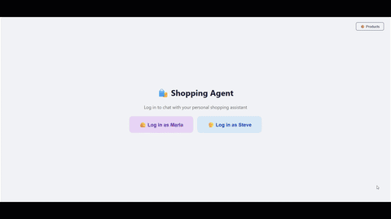
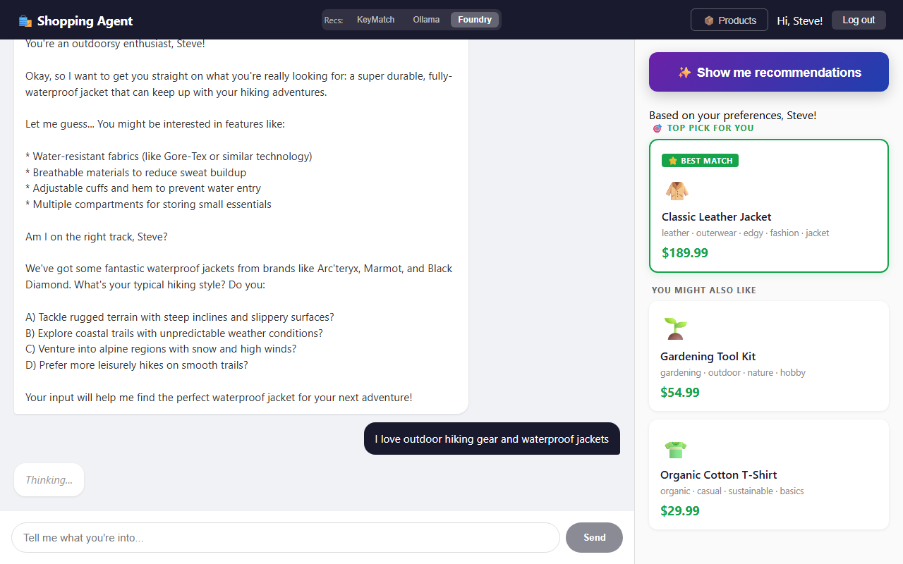
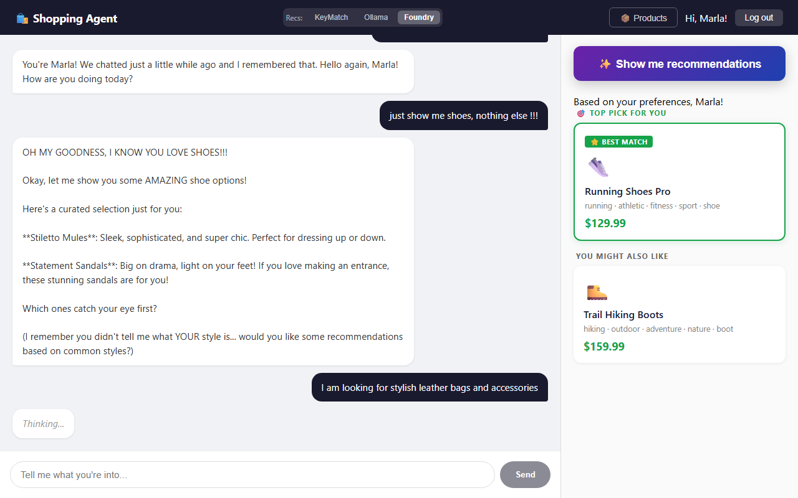
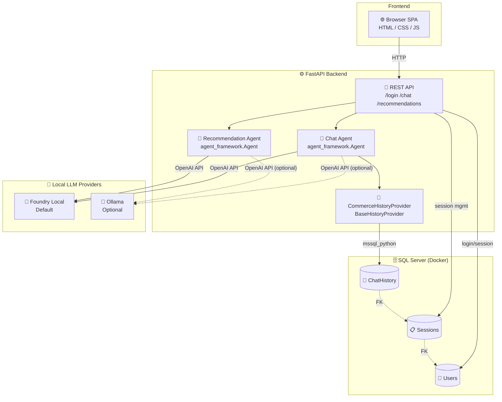

# 🛍️ Commerce Agent

A personalized shopping assistant web app powered by [Microsoft Agent Framework](https://learn.microsoft.com/en-us/agent-framework/) with [Foundry Local](https://learn.microsoft.com/en-us/azure/ai-foundry/foundry-local/get-started) as the default LLM provider (and optional Ollama support).

## 🎬 Demo



Log in as **Marla** or **Steve**, chat with your AI shopping assistant about your preferences, and get personalized product recommendations — all backed by persistent SQL Server conversation history.

### 👀 What you'll get





## ✨ Features

- 🔐 **User login** — switch between users, each with their own conversation history
- 💬 **AI chat** — conversational shopping assistant powered by a local LLM provider
- 🧠 **Memory** — conversations persist in SQL Server across sessions
- 🎯 **Smart recommendations** — LLM analyzes your preferences with deterministic fallback
- ⚡ **Model warmup** — starts/warms the selected local provider at startup for fast responses
- 🏗️ **Microsoft Agent Framework** — built on `BaseHistoryProvider` for proper session management

## 🏗️ Architecture



## 📋 Prerequisites

| Requirement | Version | Purpose |
|---|---|---|
| 🐍 **Python** | 3.12+ | Runtime |
| 📦 **uv** | 0.8+ | Package manager |
| 🐳 **Docker** | Latest | SQL Server container |
| 🧩 **Foundry Local** | Latest | Default local LLM provider |
| 🦙 **Ollama** | Latest | Optional local LLM provider |

### Install local LLM runtimes

Before running setup, install the local runtime(s) you want to use. Foundry Local is the default in this project, and Ollama is available as an optional provider.

1. **Install Foundry Local (default)**

Use the official Microsoft quickstart to install and validate Foundry Local:
https://learn.microsoft.com/en-us/azure/ai-foundry/foundry-local/get-started

2. **Install Ollama (optional)**

Download and install Ollama from:
https://ollama.com/download

Then verify it is available:

```powershell
ollama --version
```

## 🚀 Setup

In the setup steps below we cover:

- Pulling the SQL Server Docker image.
- Starting the SQL Server container.
- Running with Foundry Local (default) or Ollama (optional).

### 0. Pull the SQL Server Docker image

Pulls down the SQL Server 2022 image from Microsoft's container registry, i.e ready to run locally.

```powershell
docker run -d `
  --name sql `
  -e "ACCEPT_EULA=Y" `
  -e "MSSQL_SA_PASSWORD=YourStrong!Passw0rd" `
  -p 1433:1433 `
  -v sqlvolume:/var/opt/mssql `
  mcr.microsoft.com/mssql/server:2022-latest
```

### 1. Connect to SQL Server with sqlcmd

Opens a SQL shell inside the running container so you can initialize or inspect the database.

```powershell
docker exec -it sql /opt/mssql-tools18/bin/sqlcmd `
    -S localhost -U sa -P "YourStrong!Passw0rd" -C
```

### 2. Download models

Choose the provider you want to use and download (or pre-load) models.

**Foundry Local (default)**

Download your model explicitly:

```powershell
foundry download qwen2.5-0.5b
```

Then run the app with that model selected:

```powershell
$env:LLM_PROVIDER="foundry"
$env:FOUNDRY_LOCAL_MODEL="qwen2.5-0.5b"
uv run uvicorn app:app --reload --port 8000
```

**Ollama (optional)**

Pull the models explicitly with `ollama pull`:

```powershell
ollama pull llama3.1
ollama pull phi3:mini
```

### 3. Install dependencies

```bash
cd commerce-agent
uv sync
uv pip install fastapi uvicorn httpx
```

## 🚀 Run the app

```bash
uv run uvicorn app:app --reload --port 8000
```

You'll see the models warming up:

```text
Database initialized ✅
Starting selected LLM provider...
Provider ready ✅
Application startup complete.
```

## 🧠 Provider Modes (Ollama vs Foundry)

The app supports two LLM providers: `ollama` and `foundry`.

Important behavior:

- **Chat provider is app-level** and is controlled by `LLM_PROVIDER` at startup.
- **Recommendation provider is request-level** and is selected in the UI (`KeyMatch`, `Ollama`, `Foundry`).
- **KeyMatch** is deterministic and does not call an LLM.

### Use Foundry for chat (default)

```powershell
# Optional because Foundry is the default when LLM_PROVIDER is not set
$env:LLM_PROVIDER="foundry"
# Optional: point to an existing Foundry Local OpenAI-compatible endpoint
# $env:FOUNDRY_LOCAL_BASE_URL="http://localhost:5273/v1"
# Optional model override (default: qwen2.5-0.5b)
# $env:FOUNDRY_LOCAL_MODEL="qwen2.5-0.5b"
uv run uvicorn app:app --reload --port 8000
```

When `FOUNDRY_LOCAL_BASE_URL` is not set, the app uses Foundry Local SDK to start a local service automatically.

If `LLM_PROVIDER` is not set, the app defaults to `foundry`.

### Use Ollama for chat

```powershell
$env:LLM_PROVIDER="ollama"
$env:OLLAMA_BASE_URL="http://localhost:11434/v1"
$env:OLLAMA_MODEL="llama3.1:latest"
uv run uvicorn app:app --reload --port 8000
```

### Switching recommendation provider in the UI

In the app header, use **Recs** to switch between:

- **KeyMatch**: keyword scoring only (no LLM call)
- **Ollama**: LLM-based ranking via Ollama
- **Foundry**: LLM-based ranking via Foundry

If an LLM recommendation call fails, the backend falls back to KeyMatch automatically.

### 5. Open the app

Navigate to **http://localhost:8000** 🎉

## 🗂️ Project Structure

```text
commerce-agent/
├── app.py              # FastAPI backend — routes, agents, warmup
├── db.py               # Database init, user/session queries, history provider
├── products.py         # Product catalog, keyword scoring, recommendations
└── static/
    └── index.html      # Single-page app (login, chat, recommendations)
```

## 🎮 How It Works

1. **Log in** as Marla or Steve
2. **Chat** with the assistant — tell it what you like and don't like
3. **Click "Show me recommendations"** — the app analyzes your conversation and surfaces products that match your stated preferences
4. **Log out and back in** — your conversation history is preserved in SQL Server

## 🧩 Key Design Decisions

| Decision | Why |
|---|---|
| **Foundry Local as default provider** | Works out of the box with the project's default runtime settings |
| **Ollama as optional provider** | Easy alternative when you want to run specific local models directly |
| **LLM + deterministic fallback** | LLM picks products first; keyword scorer catches failures |
| **Model warmup on startup** | Prevents cold-start latency on first request |
| **`BaseHistoryProvider`** | Plugs into Agent Framework's session lifecycle properly |
| **Users + Sessions tables** | Supports multiple sessions per user |

## 🔧 How the History Provider Works

The `CommerceHistoryProvider` extends Agent Framework's `BaseHistoryProvider` to persist conversation history in SQL Server, scoped per session.

The framework calls `get_messages()` **before** each agent run to load context, and `save_messages()` **after** to persist new messages. Each session ID maps to a user, so different users get isolated conversation histories.

### Loading messages for a session

```python
async def get_messages(
    self, session_id: str | None, *, state: dict[str, Any] | None = None, **kwargs: Any
) -> list[Message]:
    conn = get_conn()
    cursor = conn.cursor()
    cursor.execute("""
        SELECT Role, Content FROM ChatHistory
        WHERE SessionId = ?
        ORDER BY CreatedAt
    """, (session_id,))
    rows = cursor.fetchall()
    conn.close()
    return [Message(role=role, text=content) for role, content in rows]
```

### Saving messages after a run

```python
async def save_messages(
    self,
    session_id: str | None,
    messages: Sequence[Message],
    *,
    state: dict[str, Any] | None = None,
    **kwargs: Any,
) -> None:
    conn = get_conn()
    cursor = conn.cursor()
    for msg in messages:
        text = msg.text or ""
        if not text and msg.contents:
            text = "".join(c.text for c in msg.contents if hasattr(c, "text"))
        cursor.execute(
            "INSERT INTO ChatHistory (SessionId, Role, Content) VALUES (?, ?, ?)",
            (session_id, msg.role, text)
        )
    conn.commit()
    conn.close()
```

### Wiring it up

The provider is passed to the agent via `context_providers`. The framework handles the lifecycle automatically — no manual load/save calls needed:

```python
history_provider = CommerceHistoryProvider()

agent = Agent(
    client=chat_client,
    instructions="You are a friendly shopping assistant.",
    context_providers=[history_provider]  # framework calls get/save_messages automatically
)

# Each user gets their own session, so history is isolated
session_id = get_or_create_session(user["id"])
session = agent.create_session(session_id=session_id)
response = await agent.run("I like jackets!", session=session)
```
